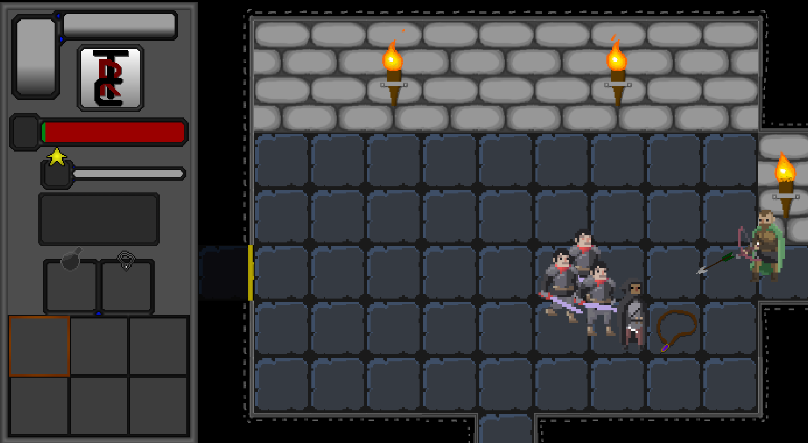

# The Restless Caverns - The best dungeon crawler of all time

 

[[_TOC_]] 

## General Information

"The Restless Caverns" is the best dungeon crawler the world has ever seen.  

The project was created by @GammelJAN and @JonathanHager  
The project is still being updated, and far from finished.  
The future of this game is **HUGE**.  

Engine: libGDX - https://libgdx.badlogicgames.com/  

## Installation

#### newest Build:  

Download executable -jar here:  
https://send.firefox.com/download/04dde021f2f23c45/#HErUzC8M5guBWYE-wRZLgg  

## Known Issues

## Controls

**W**: move up  
**A**: move left  
**S**: move down  
**D**: move right  
**SPACE**: Attack  
**F**: pick up  
**R**: equip selected item  
**scroll-wheel**: change selected item  
**Q**: drop selected Item  
**ESC**: pause Game / resume Game  

## Information about the code

### Model

### View

### Control

## Contact

Mail:  
therestlesscaverns@gmail.com  

GitLab:  
@GammelJAN  
@Jonathanhager  